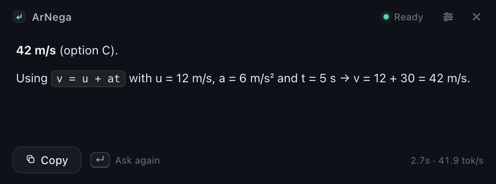

<div align="center">
  

  <h1>ArNega</h1>

  <p><strong>See it. Press Enter. Get the answer.</strong></p>

  <p>
    A fully local screen question-answering assistant for macOS.<br/>
    ArNega reads what's on your screen and answers using AI that runs on <em>your</em> Mac through
    <a href="https://ollama.com">Ollama</a> — no API keys, no subscriptions, no accounts, no cloud.
  </p>

  <p>
    <a href="#installation">Install</a> ·
    <a href="#how-it-works">How it works</a> ·
    <a href="#development">Development</a> ·
    <a href="#privacy">Privacy</a> ·
    <a href="docs/ARCHITECTURE.md">Architecture</a>
  </p>

  
</div>

---

## What it does

You have a question on screen — a math problem, a failing test, a chart, a multiple-choice
question, a paragraph you don't understand. ArNega is already open. You press **Enter**.

1. ArNega captures the relevant display (hiding itself first, so it never appears in its own screenshot).
2. The capture is optimized in memory and sent to **Ollama on `127.0.0.1`** — never to a cloud API.
3. A local vision-reasoning model (default: `qwen3-vl:8b-thinking-q4_K_M`) works the problem out.
4. The answer streams into a quiet, translucent overlay. **Esc** hides it. **⌘⇧Space** brings it back anywhere.

No prompt typing. No copy-paste. No per-question bill.

## Features

- **One-key workflow** — Enter captures, reads, reasons, and answers (only while ArNega is focused; it never hijacks Enter globally).
- **Local inference only** — the app's only AI endpoint is `http://127.0.0.1:11434`. There is no API-key screen because there is nothing to put one in.
- **Reasoning model** — uses the model's thinking channel for hard problems, and shows you only the useful answer.
- **Screen-aware** — handles text, code, diagrams, tables, charts, and answer choices; tuned prompts watch for negation, units, and constraint wording.
- **Streamed answers** with Markdown, code formatting, selectable text, one-click copy, and cancel.
- **Minimal by design** — a compact glass overlay that grows with the answer, plus a small native settings window.
- **Private by default** — no telemetry, no analytics, no accounts, no tracking. One local settings file.

## Requirements

| | |
|---|---|
| **Mac** | Apple Silicon (M-series), macOS 12+ |
| **Memory** | 16 GB recommended for the default 8B model |
| **Disk** | ~6 GB one-time model download (via Ollama) |
| **Software** | [Ollama](https://ollama.com/download) (free) |

Intel Macs and Windows are not supported yet (the architecture keeps them possible later).

## Installation

1. **Download** the latest `ArNega-<version>-mac-arm64.dmg` from [Releases](../../releases/latest) and drag **ArNega** into **Applications**.
2. **First launch:** this build isn't notarized with Apple yet. If macOS blocks it, open
   **System Settings → Privacy & Security** and choose **Open Anyway**
   (details: [docs/MACOS-DISTRIBUTION.md](docs/MACOS-DISTRIBUTION.md)). Never disable Gatekeeper for this — it isn't needed.
3. **Install Ollama** from [ollama.com/download](https://ollama.com/download) and open it once.
4. **Get the model** — ArNega offers the one-time ~6 GB download in-app, or run:
   ```bash
   ollama pull qwen3-vl:8b-thinking-q4_K_M
   ```
5. **Grant Screen Recording permission** when macOS asks on your first Enter — that's how ArNega sees the screen. (It requests nothing else: no microphone, camera, contacts, or location.)

Verify downloads against `SHA256SUMS.txt` attached to every release.

## How it works

```
        Enter (overlay focused)
              │
              ▼
   hide ArNega windows ── content protection stays on as backup
              │
              ▼
   capture display (in memory, full Retina res)
              │
              ▼
   downscale + encode per quality preset (Fast / Balanced / High detail)
              │
              ▼
   POST http://127.0.0.1:11434/api/chat   ← the only AI endpoint
   { model, system prompt, screenshot, think: true, keep_alive: 30m }
              │
              ▼
   stream: thinking (hidden) → answer tokens → overlay (Markdown)
```

The main-process pipeline lives in [`apps/desktop/src/main`](apps/desktop/src/main); the pure logic
(prompts, streaming parsers, settings validation, state machine) is in
[`packages/shared`](packages/shared) with 59 unit tests. Full details: [docs/ARCHITECTURE.md](docs/ARCHITECTURE.md).

## Development

```bash
git clone <this repo> && cd ArNega
npm run setup        # validates Node 20+, installs workspaces, checks Ollama
npm run dev:desktop  # Electron app with hot reload
npm run dev:website  # marketing site at http://localhost:4321
npm run check        # typecheck + lint + all unit tests
```

Handy extras:

```bash
npm run test -w @arnega/desktop                      # desktop unit tests
npx vitest run -c vitest.integration.config.ts       # live Ollama integration tests (in apps/desktop)
npm run gen:icons                                    # regenerate icons from the SVG sources
npx vite -c vite.renderer-dev.config.ts              # overlay UI in a browser with mock states (?mock=answer …)
```

## Building

```bash
npm run build:desktop   # electron-vite production bundles (apps/desktop/out)
npm run dist:desktop    # + electron-builder → DMG/ZIP in apps/desktop/release
npm run build:website   # static site → apps/website/dist
```

## Releasing

One command bumps the version everywhere, then a tag does the rest in CI
(tests → macOS arm64 build → DMG/ZIP → SHA-256 → GitHub Release):

```bash
node scripts/set-version.mjs 0.2.0
git commit -am "v0.2.0" && git tag v0.2.0 && git push && git push --tags
```

Runbook: [docs/RELEASING.md](docs/RELEASING.md) · Website deploys: [docs/WEBSITE.md](docs/WEBSITE.md)

## Privacy

- Captures are processed **in memory** and sent only to local Ollama; they are not saved to disk by the primary path and are never uploaded.
- The only external connections are ones you explicitly click (e.g. Ollama's download page) and the model download you approve, which Ollama itself performs.
- ArNega stores exactly one file: `~/Library/Application Support/ArNega/settings.json`.
- No telemetry, no analytics, no crash reporting, no accounts.

Full engineering detail and how to verify it yourself: [docs/PRIVACY.md](docs/PRIVACY.md).

## Known limitations

- **Answers can be wrong.** An 8B local model is fast and private, not infallible — verify anything that matters.
- **Unsigned build.** Until Developer ID signing/notarization is set up, macOS shows a one-time approval flow ([docs/MACOS-DISTRIBUTION.md](docs/MACOS-DISTRIBUTION.md)).
- **Capture privacy is best-effort.** ArNega asks macOS to exclude its overlay from ordinary screen capture (`setContentProtection`), but this is **not** a guarantee and varies by macOS version and capture method. ArNega is not designed to evade proctoring, anti-cheat, or monitoring software — see [responsible use](apps/website/src/pages/responsible-use.astro).
- **Memory pressure.** The default model wants several GB of unified memory while answering; 8 GB Macs should pick a smaller vision model in Settings.
- **First token latency** depends on whether the model is warm; ArNega pre-loads it and keeps it alive for 30 minutes between questions.

## Repository layout

```
apps/desktop      Electron app (main / preload / renderer)
apps/website      Astro marketing site (GitHub Pages)
packages/shared   Pure TS core: config, prompts, parsers, settings, IPC types
packages/branding Design tokens + SVG identity + icon pipeline
docs/             Architecture, privacy, releasing, security, …
.github/workflows CI, Pages deploy, tag-triggered releases
scripts/          setup, versioning, icon/OG generation, QA tooling
```

## Contributing

Issues and pull requests are welcome once the repository is public. Until a license is chosen
(see below), significant external contributions are better discussed in an issue first.

## Licensing

**A license has not been chosen yet** — the code being visible does not yet grant reuse rights.
The options and their trade-offs are laid out in [docs/LICENSING-TODO.md](docs/LICENSING-TODO.md).
The app is free to download and use.
