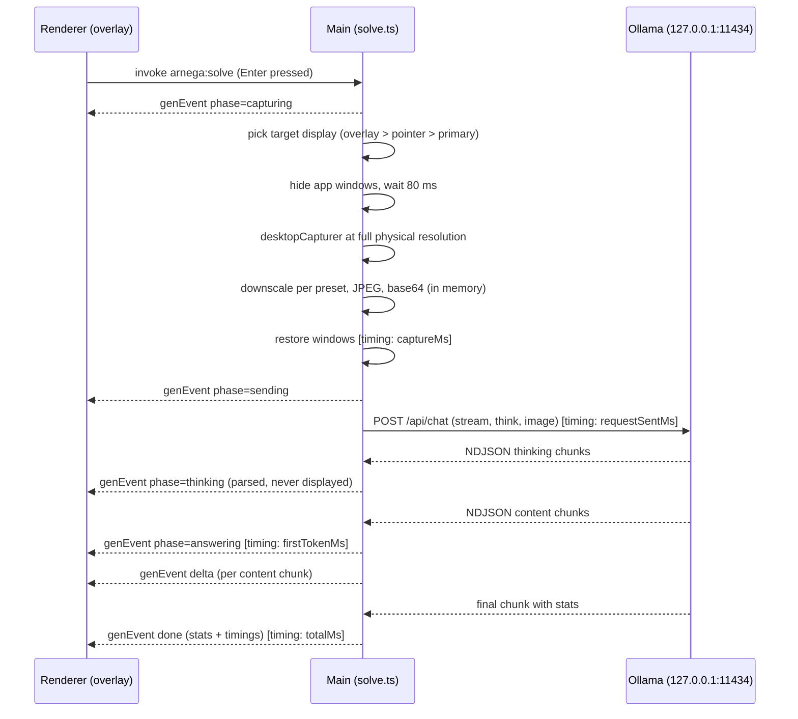

# ArNega Architecture

ArNega is a fully local screen question-answering assistant for macOS (Apple Silicon). Press Enter while the overlay is focused, ArNega captures the screen, sends it to a local Ollama model, and streams the answer back. No cloud AI endpoints, no API keys, no telemetry.

This document describes how the codebase is organized and how the pieces interact. Companion docs: `docs/SECURITY.md` (threat model and hardening) and `docs/PRIVACY.md` (data handling).

## Monorepo layout

```
ArNega/
├── apps/
│   ├── desktop/          Electron app (main / preload / renderer)
│   └── website/          Astro static site with React islands
├── packages/
│   ├── shared/           Pure TypeScript core (no Electron, no DOM, no I/O)
│   └── branding/         Design tokens + SVG identity
├── scripts/              Version sync, icon/OG generation, setup
├── docs/                 Project documentation
└── .github/workflows/    ci.yml, pages.yml, release.yml
```

npm workspaces (`packages/*`, `apps/*`), Node >= 20. Root commands: `npm run setup | typecheck | lint | test | check | dev:desktop | dev:website | build:desktop | build:website | dist:desktop | gen:icons`.

### Why this shape

- **`packages/shared` holds every rule that does not need a platform.** Config constants, the settings schema and its normalization, prompt construction, NDJSON stream parsers, screenshot resize math, the setup state machine, the IPC contract, and release URL builders all live here as pure functions. They are exhaustively unit-testable (59 tests) without booting Electron, and both the desktop app and the website consume them.
- **The apps stay thin.** `apps/desktop` contains only the code that must touch Electron, macOS, or the DOM. `apps/website` contains only presentation; it reuses `@arnega/shared` for the repo slug and download URL builders so the site and app can never disagree about release artifacts.
- **`packages/branding` keeps identity in one place** so the app icon, website, and generated assets (`scripts/generate-icons.mjs`, `scripts/generate-og.mjs`) derive from the same tokens.
- **One version source.** `packages/shared/src/version.ts` (`APP_VERSION`, `APP_NAME`, `APP_ID`) plus the package.json versions, kept in sync by `scripts/set-version.mjs`. The release workflow refuses to build if the tag and version disagree.

## Desktop process model

Standard Electron three-process split, with the strictest practical isolation:

| Process | Source | Runs as |
|---|---|---|
| Main | `apps/desktop/src/main/` | Node.js — windows, capture, Ollama client, settings, shortcuts |
| Preload | `apps/desktop/src/preload/index.ts` | Isolated bridge — exposes exactly the typed `ArnegaApi` as `window.arnega` |
| Renderer | `apps/desktop/src/renderer/` | Sandboxed Chromium — React 19 UI, no Node access |

Every window is created with `contextIsolation: true`, `sandbox: true`, `nodeIntegration: false`. The renderer never sees `ipcRenderer` directly; the preload wraps each channel from the `IPC` constant map in `packages/shared/src/ipc.ts` into a typed method, and event subscriptions return unsubscribe functions. Main-side handlers validate the sender frame (dev-server URL or `file://`) and every payload; settings updates are filtered through an explicit key allowlist before they touch disk.

### Build pipeline (electron-vite)

`apps/desktop/electron.vite.config.ts` defines three Vite builds — `main`, `preload`, `renderer` — emitted to `apps/desktop/out/` (`out/main/index.js` is the Electron entry). Notable choices:

- `externalizeDepsPlugin({ exclude: ['@arnega/shared', '@arnega/branding'] })`: dependencies stay external to the main/preload bundles **except** the workspace packages, which are bundled in.
- Source maps are enabled for all three targets.
- Aliases `@main` and `@renderer` shorten intra-app imports.

`npm run dev:desktop` runs `electron-vite dev` with HMR (`ELECTRON_RENDERER_URL` points the windows at the dev server). `npm run dist:desktop` runs `electron-vite build && electron-builder --mac --arm64`, producing the DMG/ZIP in `apps/desktop/release/`.

### Shared packages are consumed as source

`@arnega/shared` publishes no build output. Its `package.json` points `main`, `types`, and `exports` straight at `./src/index.ts`. Vite (and Vitest, and Astro) compile the TypeScript on the fly, and electron-vite bundles it into each process's output because it is excluded from externalization. There is no compile step, no stale `dist/` to chase, and a change in shared code is picked up by every consumer immediately. The cost is that consumers must be able to transpile TS — which every toolchain in this repo does.

## The Enter solve flow

Enter is handled by a plain `keydown` listener inside the focused overlay window (`renderer/src/overlay/OverlayApp.tsx`) — deliberately **not** a global shortcut, so ArNega never intercepts Enter from other apps. The renderer calls `window.arnega.solve()`; everything else happens in the main process (`main/solve.ts`), which reports progress via broadcast `GenEvent`s rather than the invoke's return value, so the UI streams in real time.



Step by step:

1. **Guard.** One generation at a time; a second Enter is rejected while one is in flight. If the setup state is not `ready`/`model-loading`, solve returns an error and triggers a status refresh.
2. **Display selection.** `main/display.ts` (pure, unit-tested) prefers the display containing most of the overlay, then the display containing the pointer, then the primary display.
3. **Clean capture.** App windows are hidden (guaranteed-clean shot; the overlay's `setContentProtection(true)` is defense-in-depth, not relied on), the code waits 80 ms for the compositor to commit, then `desktopCapturer` grabs the target display at full physical resolution (`size × scaleFactor`), entirely in memory. Windows are restored in a `finally`.
4. **Optimize.** `packages/shared/src/screenshot.ts` computes the resize target — long edge 1280 (fast), 1680 (balanced, default), or 2440 (high); JPEG quality 62/78/92% — then the image is encoded and base64'd. Downscale only, never upscale.
5. **Fallback capture.** If `desktopCapturer` fails, `/usr/sbin/screencapture -x` writes a random-named temp file, which is read and deleted in a `finally` block.
6. **Request.** `main/ollama.ts` POSTs to `/api/chat` on `http://127.0.0.1:11434` with the system prompt, a short style-specific user instruction, the image, `num_ctx`, `keep_alive`, `temperature: 0.2`, and `think: true` when the model advertises the `thinking` capability (via `/api/show`, with a name heuristic fallback).
7. **Stream.** The NDJSON body is fed through `NdjsonBuffer` + `parseChatLine` (pure parsers in shared). Thinking chunks flip the phase to `thinking` but their text is never shown; the first content chunk records `firstTokenMs` and flips to `answering`; each content chunk is broadcast as a `delta`.
8. **Finish.** `done` carries Ollama's stats plus the measured timings (`captureMs`, `requestSentMs`, `firstTokenMs`, `totalMs`), which the overlay footer shows subtly. Cancel (button in the UI) aborts via `AbortController`; errors are mapped to actionable messages (Ollama down, model missing, permission, memory) and trigger a setup re-probe.

## Module map: `apps/desktop/src/main/`

| File | Responsibility |
|---|---|
| `index.ts` | Entry point: app name, single-instance lock, window/menu/IPC bootstrap, global shortcut, warm-up, 20 s status poll |
| `capture.ts` | Capture pipeline: `desktopCapturer` at physical resolution → optimize → base64, with `screencapture` CLI fallback |
| `display.ts` | Pure display-selection logic (overlay → pointer → primary) and saved-bounds visibility check; unit-tested |
| `external.ts` | Allowlist of the only external URLs the app opens (`ollama-download`, `model-info`, `repo`, `releases`); renderer names a target, never a URL |
| `ipc.ts` | The entire IPC surface: sender validation, payload sanitization, settings key allowlist, handler registration |
| `menu.ts` | Minimal native menu (About, Settings Cmd+, Edit roles for copy/paste, Show ArNega, Quit) |
| `ollama.ts` | The only module that performs AI networking — probe, model list/capabilities, chat streaming, warm-up, model pull; loopback only |
| `permissions.ts` | Screen Recording permission status (`systemPreferences.getMediaAccessStatus('screen')`) and the System Settings deep link |
| `settings-store.ts` | `settings.json` persistence in userData with atomic tmp+rename writes; corrupt files self-heal via `normalizeSettings`; clear-local-state |
| `shortcuts.ts` | The single global show/hide accelerator; Enter is intentionally never registered globally |
| `solve.ts` | The Enter workflow orchestration: capture → stream → `GenEvent`s, timings, cancellation, friendly error mapping |
| `status.ts` | Local AI stack state: probes Ollama, derives steady states via the shared reducer, drives model download and warm-up, broadcasts changes |
| `windows.ts` | Overlay and settings `BrowserWindow`s: hardening, content protection, bounds persistence, content-driven resize, hide-for-capture, `broadcast()` |

## Renderer structure

One React bundle serves both windows; `?view=overlay|settings` (dev-server query or `loadFile` query) selects the app in `App.tsx`.

```
apps/desktop/src/renderer/
├── index.html                 CSP meta ('self' only; localhost allowed for the dev server)
└── src/
    ├── main.tsx               Mounts <App/>; installs the mock API in a plain browser during dev
    ├── App.tsx                View switch: overlay vs settings
    ├── overlay/
    │   ├── OverlayApp.tsx     Enter/Esc handling, gen-event reducer, streamed Markdown answer,
    │   │                      auto-scroll, content-driven window resize, copy/cancel, timings footer
    │   └── SetupCard.tsx      Guided setup states (install Ollama, start it, pull model, permission)
    ├── settings/
    │   ├── SettingsApp.tsx    Model picker, answer style, quality preset, context size, shortcut, etc.
    │   └── ShortcutRecorder.tsx  Records an Electron accelerator from raw key events (unit-tested)
    ├── hooks/useAppStatus.ts  Live AppStatus: fetch on mount/show, subscribe to broadcasts
    ├── components/            BrandSymbol, Icons
    ├── lib/                   accelerator.ts (key → accelerator mapping), format.ts (durations etc.)
    ├── dev/mockApi.ts         Browser-only ArnegaApi mock for exercising every UI state
    └── styles/global.css      Single stylesheet (HUD vibrancy-aware overlay styling)
```

Answers render through `react-markdown` + `remark-gfm`; links in answers are inert (no `href`, pointer-events disabled) so model output can never trigger navigation. The overlay asks main to resize the window as content grows (`resizeOverlay`), clamped in main to the display work area.

## State flow

Two kinds of main → renderer push, both sent through `broadcast()` in `windows.ts` to every live window:

- **Status broadcasts.** `main/status.ts` owns a `SetupStatus` (`checking | ready | ollama-missing | ollama-not-running | model-missing | model-downloading | model-loading | error`). Steady states come from the pure reducer `deriveSetupState` in `packages/shared/src/state.ts`; transient states (download progress with bytes/percent, warm-up) are set imperatively. Every change is broadcast on `arnega:setup-status`; settings changes are broadcast on `arnega:settings-changed`; `arnega:window-shown` tells the overlay it was just summoned. The renderer's `useAppStatus` hook fetches the full `AppStatus` on mount and on show, then patches it from these broadcasts. Main re-probes Ollama every 20 s while idle.
- **Gen events.** During a solve, `main/solve.ts` broadcasts `arnega:gen-event` messages — `phase` (capturing → sending → thinking → answering, plus cancelled), `delta` (answer text chunk), `done` (stats + timings), or `error`. Each carries a `requestId`. `OverlayApp` folds them into local component state; there is no state library — the main process is the source of truth and the renderer is a projection of it.

Requests in the other direction are all `ipcRenderer.invoke` calls behind the typed `ArnegaApi` (`packages/shared/src/ipc.ts`), so the full contract between processes is a single reviewable file.

## Portability notes (future Windows / Intel)

ArNega v0.1.0 targets macOS on Apple Silicon only. The architecture keeps the portable core large and the platform edge small; this is what actually needs work per platform:

**Already portable**
- Everything in `packages/shared` — no platform APIs at all.
- The renderer (checks `window.arnega.platform` where labels differ; `CommandOrControl` accelerators map to Ctrl on Windows).
- The primary capture path (`desktopCapturer`), the display-selection logic, the Ollama client, the settings store (`app.getPath('userData')` resolves per-OS), IPC, and the solve orchestration.

**macOS-specific today**
- **Capture fallback** — `main/capture.ts` shells out to `/usr/sbin/screencapture`. Windows would need a different fallback (or none; the primary path is cross-platform).
- **Permissions** — `main/permissions.ts` uses `systemPreferences.getMediaAccessStatus('screen')` and the `x-apple.systempreferences:…Privacy_ScreenCapture` deep link; it already returns `'unknown'` off darwin. Windows has no Screen Recording permission model, so the setup card branch simply would not apply.
- **Window chrome** — `vibrancy: 'hud'`, `visualEffectState`, `hiddenInMissionControl`, `setVisibleOnAllWorkspaces(…, { visibleOnFullScreen: true })`, and the `titleBarStyle: 'hiddenInset'` settings window are macOS-only; Windows needs a plain themed background and equivalent always-on-top behavior. `setContentProtection` does exist on Windows (display-affinity based) but, as on macOS, must be treated as best-effort.
- **Shortcuts and menu** — the app menu in `main/menu.ts` follows macOS conventions, and `index.ts` keeps the app alive on `window-all-closed` only on darwin.
- **Ollama detection** — `OLLAMA_BINARY_CANDIDATES` in `main/ollama.ts` lists macOS install paths; Windows/Linux paths would be added there. The HTTP probe itself is portable.
- **Packaging** — electron-builder is configured for `--mac --arm64` (DMG/ZIP, entitlements, future notarization). Intel macs are a build-matrix change (`x64` or a universal binary), not a code change — which is why the release naming already encodes the arch (`ArNega-<version>-mac-arm64.dmg`).

Until those exist, Windows and Intel builds are "coming later" — the codebase is structured for them, but they are not available and should not be claimed as such.
